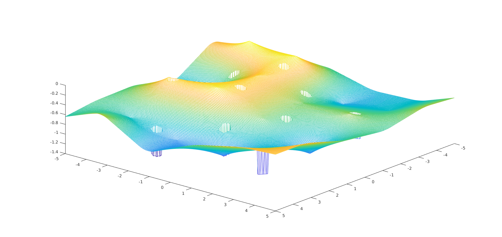

# Push Recovery

## Description

The hopping robot pushed by someone has a nonzero velocity. The control algorithm is applied to recover the robot to a stable (or near-stable) state. We assume that the robot is working in an environment which may be uneven and have holes. At any time, the robot should avoid stepping in the holes.

Example: Contour of the ground




We set up four different cases for different ground environments and planning methods:

### case 1 
Even ground with holes. Do 1D planning without environment information (the worst case).

Example: even ground with holes


### case 2 
Even ground with holes. Do 1D planning given positions and sizes of the holes in the line the robot moves along. 

### case 3
Uneven ground without holes. Do 1D planning given maximum altitude difference *hlim*. (*lmax* shrinks based on *hlim*.)

Example: How the *lmax* shrinks:


In case 3&4, the maximum length of leg is specified to decide the upper bound of *lmax*, which means that there's no one-to-one relationship b.t. *lmax* and the maximum length of leg anymore. 

### case 4
Uneven ground with holes. Do 1D planning given the ground information in the line the robot moves along (holes and altitudes of nodes in input space). In this case, the model parameter *h0* of the robot changes based on the altitude of input *x_ankle*.

## Usage
Change the current directory to case* in MATLAB *(replace * with the case number you want to test)*

```
cd case*
```

Test the code using preserved data:

```
test_control;
```

If you want to set up a new initial condition and ground environment for case 2/3/4, please run: 
```
Initial;
```
Please follow interactive instructions to finish the initialization.

Note that IC and ground environment for case 1 is set when you run *test_control*.
